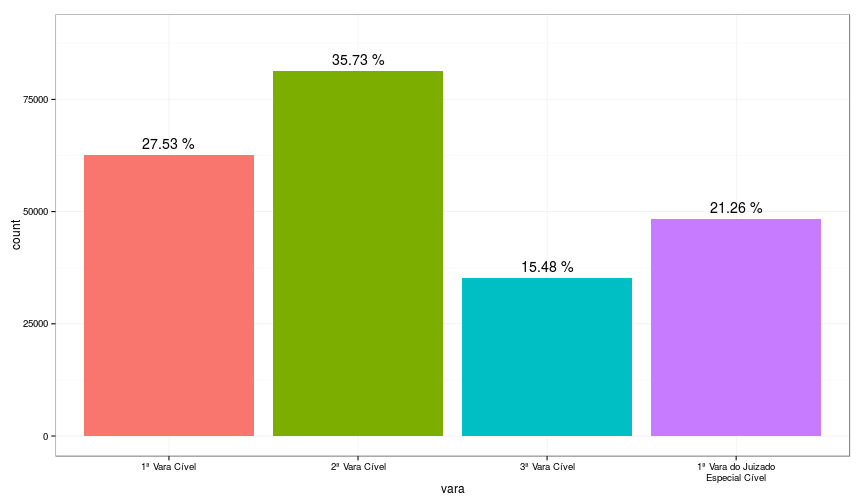
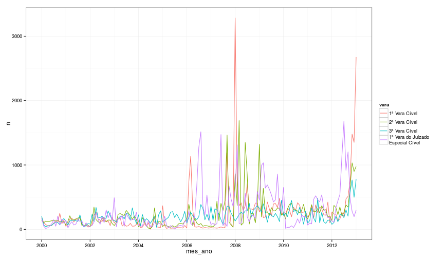
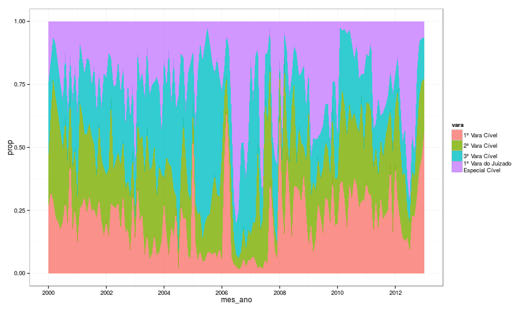
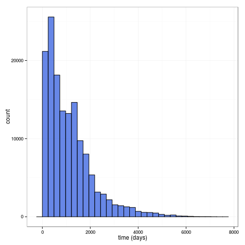
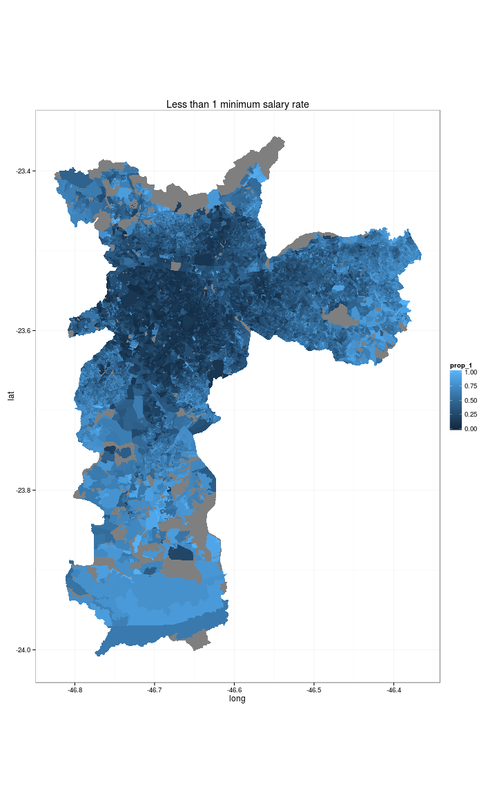
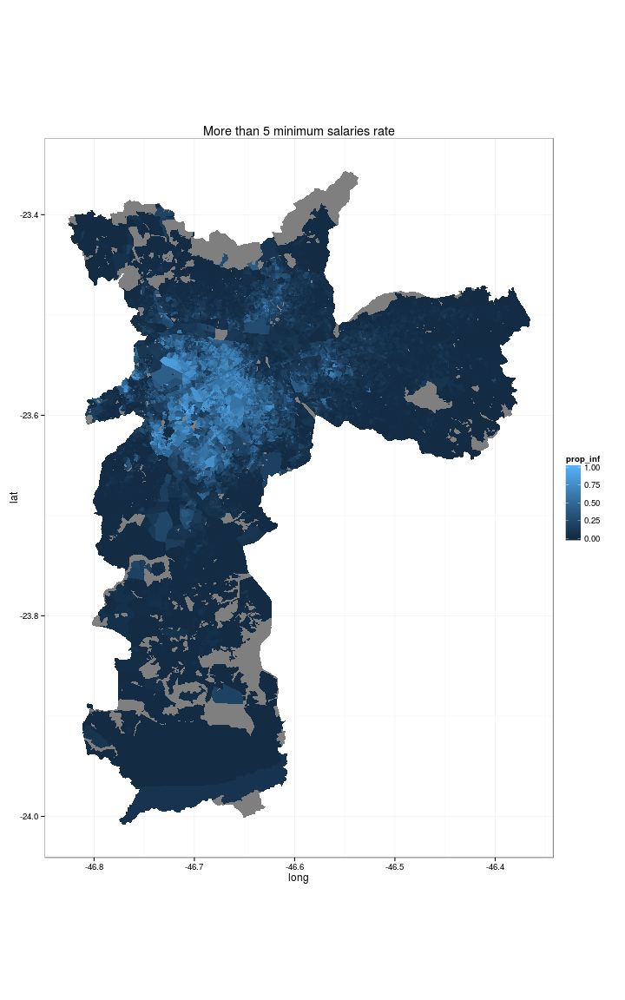

```r
library(litigation)
library(dplyr)
library(tidyr)
library(stringr)
library(ggplot2)
library(lubridate)
```

# litigation data


```r
data(processos, package = 'litigation')
data(partes, package = 'litigation')
```

## volume by lower court


```r
prop <- processos %>% 
  count(vara) %>% 
  mutate(prop = n / sum(n),
         prop_txt = paste(round(prop * 100, 2), '%'))
processos %>%
  ggplot(aes(x = vara, fill = vara)) +
  geom_bar() +
  geom_text(aes(y = n, label = prop_txt), 
            data = prop, vjust = -.5) +
  guides(fill = FALSE) +
  scale_y_continuous(limits = c(0, max(prop$n) * 1.1)) +
  theme_bw()
```

 

## litigation filing date

- Lines


```r
processos %>%
  mutate(mes_ano = as.Date(sprintf('%d-%02d-01',
                                   year(dt_distribuicao),
                                   month(dt_distribuicao)))) %>%
  count(vara, mes_ano) %>%
  ggplot(aes(x = mes_ano, y = n, colour = vara)) +
  geom_line() +
  theme_bw()
```

 

- Stacked


```r
processos %>%
  mutate(mes_ano = as.Date(sprintf('%d-%02d-01',
                                   year(dt_distribuicao),
                                   month(dt_distribuicao)))) %>%
  count(vara, mes_ano) %>%
  ggplot(aes(x = mes_ano, y = n, fill = vara)) +
  geom_area(position = 'stack', alpha = .8) +
  theme_bw()
```

 


- Proportionally


```r
processos %>%
  mutate(mes_ano = as.Date(sprintf('%d-%02d-01',
                                   year(dt_distribuicao),
                                   month(dt_distribuicao)))) %>%
  count(mes_ano, vara) %>%
  mutate(prop = n / sum(n)) %>%
  ungroup %>%
  ggplot(aes(x = mes_ano, y = prop, fill = vara)) +
  geom_area(position = 'stack', alpha = .8) +
  theme_bw()
```

 

## litigation last movement date

- Lines


```r
processos %>%
  mutate(mes_ano = as.Date(sprintf('%d-%02d-01',
                                   year(dt_mov),
                                   month(dt_mov)))) %>%
  filter(year(dt_mov) <= 2014, year(dt_mov) >= 2000) %>%
  count(vara, mes_ano) %>%
  ggplot(aes(x = mes_ano, y = n, colour = vara)) +
  geom_line() +
  theme_bw()
```

 

- Stacked


```r
processos %>%
  mutate(mes_ano = as.Date(sprintf('%d-%02d-01',
                                   year(dt_mov),
                                   month(dt_mov)))) %>%
  filter(year(dt_mov) <= 2014, year(dt_mov) >= 2000) %>%
  count(vara, mes_ano) %>%
  ggplot(aes(x = mes_ano, y = n, fill = vara)) +
  geom_area(position = 'stack', alpha = .8) +
  theme_bw()
```

 

- Proportionally


```r
processos %>%
  mutate(mes_ano = as.Date(sprintf('%d-%02d-01',
                                   year(dt_mov),
                                   month(dt_mov)))) %>%
  filter(year(dt_mov) <= 2014, year(dt_mov) >= 2000) %>%
  count(mes_ano, vara) %>%
  mutate(prop = n / sum(n)) %>%
  ungroup %>%
  ggplot(aes(x = mes_ano, y = prop, fill = vara)) +
  geom_area(position = 'stack', alpha = .8) +
  theme_bw()
```

 

## litigation time


```r
processos %>%
  filter(!is.na(tempo), tempo > 0, tempo < 3650*2) %>%
  ggplot(aes(x = tempo)) +
  geom_histogram(fill = 'royalblue', alpha = .8, colour = 'black') +
  xlab('time (days)') +
  theme_bw()
```

 

## number of litigants by case

The table below shows how many cases have zero, one or more plaintiffs / defendants


```r
autor_count <- partes %>%
  filter(tipo_parte == 'autor') %>%
  group_by(id) %>%
  summarise(n_autor = n_distinct(id_pessoa)) %>%
  ungroup()

reu_count <- partes %>%
  filter(tipo_parte == 'reu') %>%
  group_by(id) %>%
  summarise(n_reu = n_distinct(id_pessoa)) %>%
  ungroup()

aux1 <- processos %>%
  select(id) %>%
  left_join(autor_count, 'id') %>%
  mutate(n_autor = ifelse(is.na(n_autor), 0, n_autor)) %>%
  count(n_autor)

aux2 <- processos %>%
  select(id) %>%
  left_join(reu_count, 'id') %>%
  mutate(n_reu = ifelse(is.na(n_reu), 0, n_reu)) %>%
  group_by(n_reu) %>%
  summarise(n2 = n())

bind_cols(aux1, aux2) %>%
  select(times = n_autor, autor = n, reu = n2) %>%
  knitr::kable()
```


| times|  autor|    reu|
|-----:|------:|------:|
|     0| 121913| 119606|
|     1| 104900| 106131|
|     2|    815|   1852|
|     3|     30|     69|
|     4|      6|      6|

## litigants State (first 10 ordered by number of plaintiffs)


```r
partes %>%
  mutate(estado = str_sub(endereco, -2L),
         estado = ifelse(!str_detect(estado, '[a-zA-Z]{2}'), '(empty)', estado)) %>%
  count(estado, tipo_parte) %>%
  ungroup %>%
  spread(tipo_parte, n) %>%
  arrange(desc(autor)) %>%
  head(10) %>%
  knitr::kable()
```


|estado  |   autor|     reu|
|:-------|-------:|-------:|
|SP      | 6312911| 2062080|
|PR      |  149824|   21460|
|MG      |   10396|    4655|
|(empty) |    5504|    2172|
|DF      |    2881|    2790|
|RJ      |    1578|    3060|
|SC      |     974|     367|
|PE      |     607|     289|
|GO      |     433|     163|
|RS      |     323|     236|

# Census data

Empty city map by censitary unit


```r
data(d_sp_map, package = 'litigation')

d_sp_map %>%
  ggplot() +
  geom_map(aes(x = long, y = lat, map_id = id), map = d_sp_map,
           fill = 'transparent', colour = 'black', size = .08) +
  coord_equal() +
  theme_bw()
```

 

## by education


```r
data(educ, package = 'litigation')

d_sp_map %>%
  left_join(educ, c('id' = 'cod')) %>%
  ggplot() +
  geom_map(aes(x = long, y = lat, map_id = id, fill = prop_cat), 
           map = d_sp_map, colour = 'black', size = .05) +
  coord_equal() +
  theme_bw() +
  ggtitle('Literacy rate')
```

 

## by income


```r
# DomicílioRenda_UF.xls
d_sp_map %>%
  left_join(renda, c('id' = 'cod')) %>%
  ggplot() +
  geom_map(aes(x = long, y = lat, map_id = id, fill = prop_1), map = d_sp_map,
           colour = 'transparent', size = .1) +
  coord_equal() +
  theme_bw() +
  ggtitle('Less than 1 minimum salary rate')
```

 

```r
d_sp_map %>%
  left_join(renda, c('id' = 'cod')) %>%
  ggplot() +
  geom_map(aes(x = long, y = lat, map_id = id, fill = prop_5), map = d_sp_map,
           colour = 'transparent', size = .1) +
  coord_equal() +
  theme_bw() +
  ggtitle('Between 1 and 5 minimum salaries rate')
```

 

```r
d_sp_map %>%
  left_join(renda, c('id' = 'cod')) %>%
  ggplot() +
  geom_map(aes(x = long, y = lat, map_id = id, fill = prop_inf), map = d_sp_map,
           colour = 'transparent', size = .1) +
  coord_equal() +
  theme_bw() +
  ggtitle('More than 5 minimum salaries rate')
```

 

